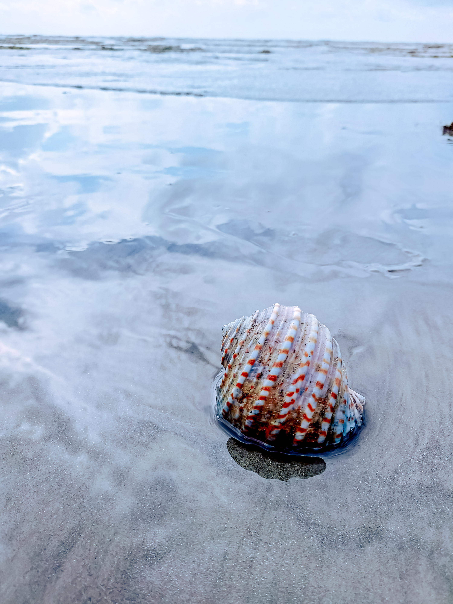
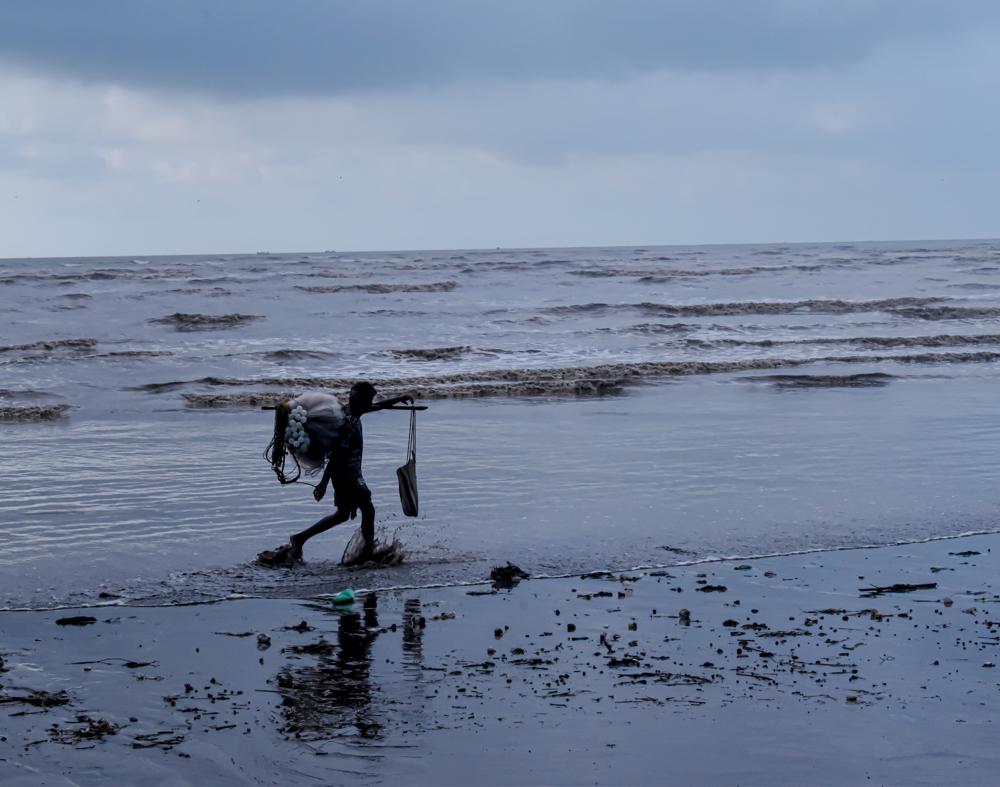

Oh, what a beach! If you haven't seen this, your idea of beach isn't complete. Here one can literally see the sea disappear by almost 5 to 6 kilometres everyday during low tide and then comes back at high tide. This rare event occurs twice a day.
 
The beach is located on the shore of Bay of Bengal and is approximately 16 kilometers from the Balasore Railway Station. Chandipur in Balasore is a unique beach where the sea recedes up to 5 km twice a day during ebb tides. During when the sea recedes, the beach turns into a biodiversity hotspot. You may also find lots of ghost red crabs, shells on the beach during ebb tide.

The Chandipur coast has attained global popularity for its ‘Vanishing Sea’ phenomenon. 
