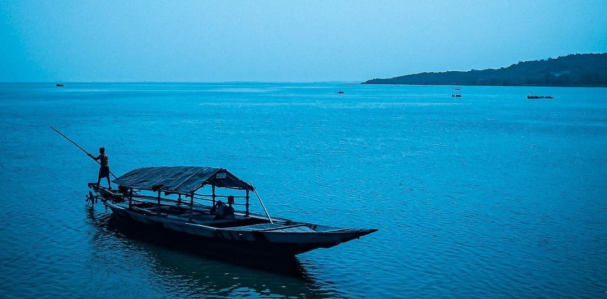
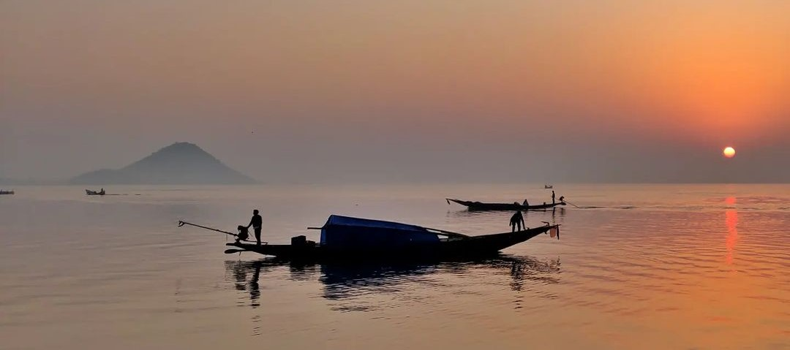
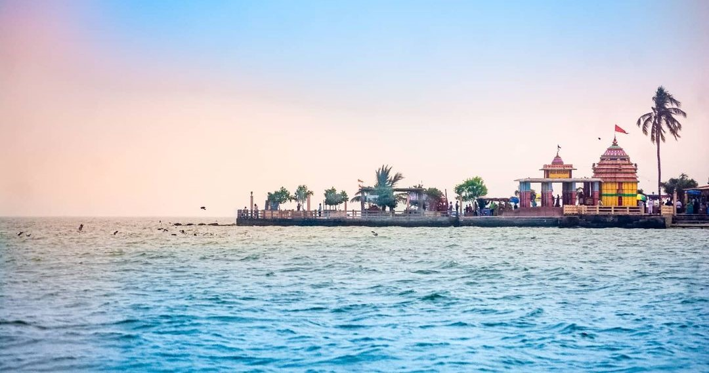
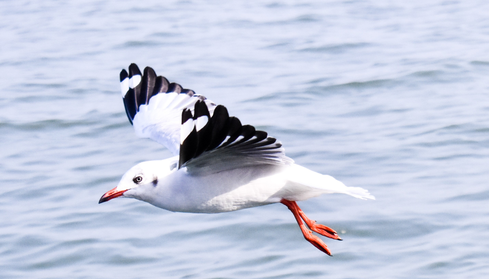
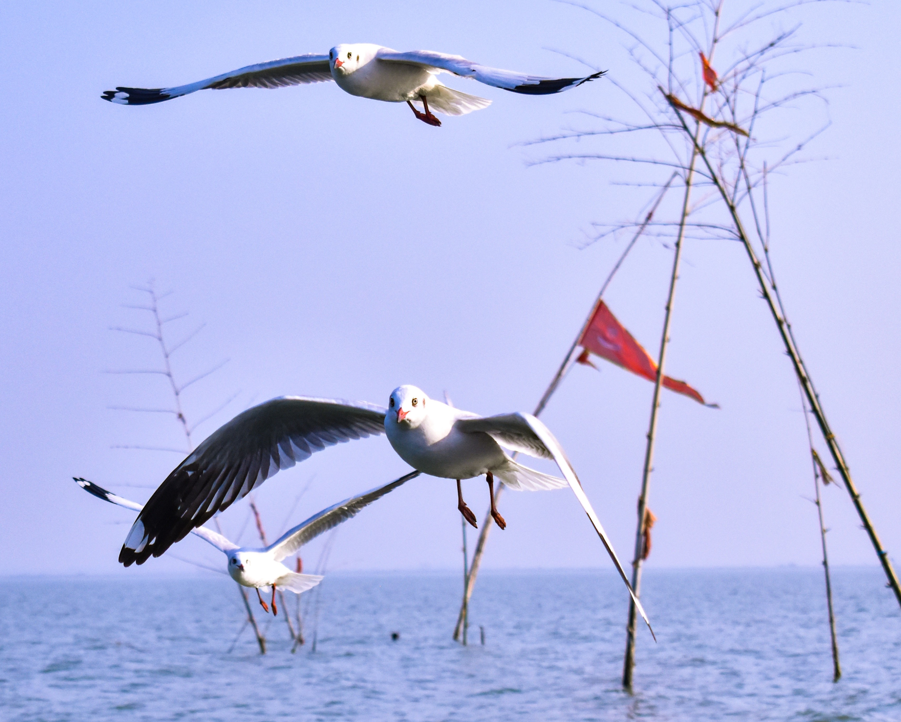
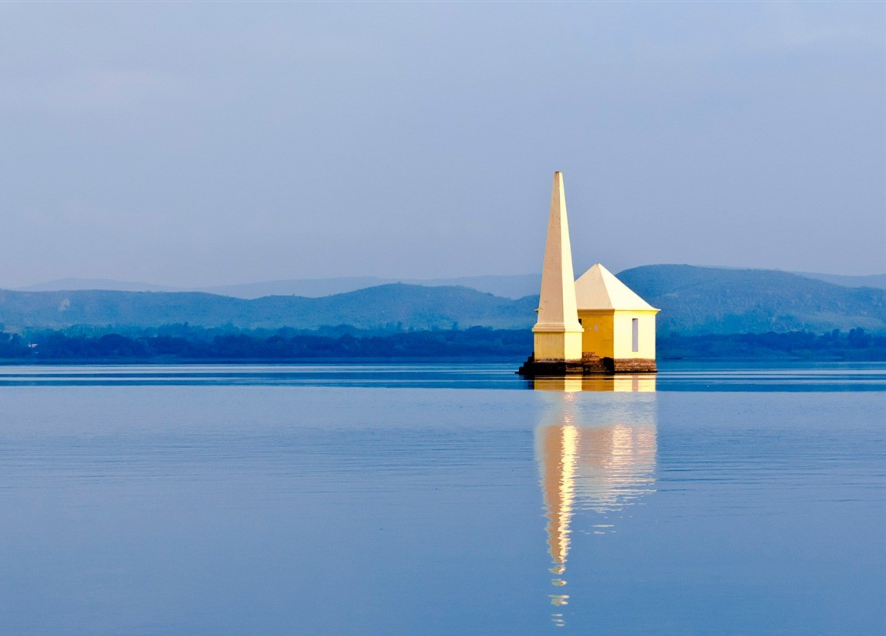

Chilika Lake is a brackish water lagoon, spread over the Puri, Khurda and Ganjam districts of Odisha state on the east coast of India, at the mouth of the Daya River, flowing into the Bay of Bengal, covering an area of over 1,100 km². It is the biggest lake of India after Vembanad Lake.


**Some pictures of the mesmerizing chilika**

**Scenic Places To Visit In & Around Chilika**

**Kalijai Temple**
This temple is situated right on an island where the presiding deity is Goddess Kalijai. If any day you are visiting Chilika and feel like having a religious connect with its surroundings, then we best advise you to visit this temple.

**Nalabana Island**
Nalbana Bird Sanctuary or Nalbana Island is the core area of the Ramsar designated wetlands of Chilika Lake. It was declared a bird sanctuary under the Wildlife Protection Act in 1972.

**Breakfast Island**
As its name, the Breakfast Island is a unique place in itself. It is basically shaped as a pear and lies between Badakuda and Somolo islands near Rambha.

