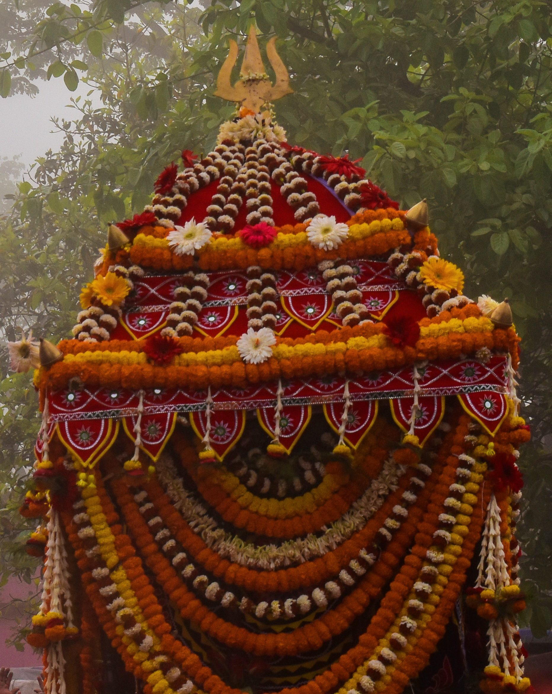
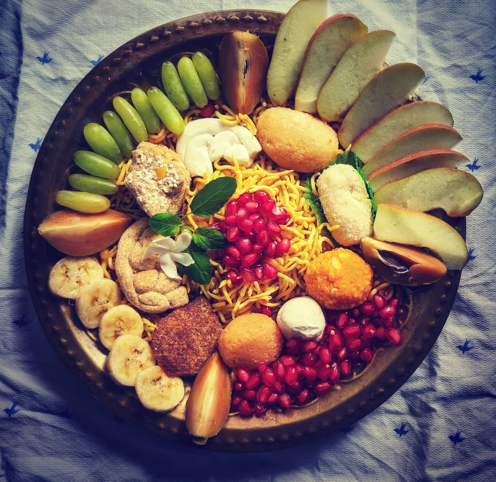

Dola Purnima is a popular festival in the coastal districts of Odisha. Lord Jagannath is worshiped as the name of Dolagovinda in this festival. On this day Oriya calendar becomes ready and it is worshiped on Dolabedi infront of Dolagovinda. It is the fullmoon day in the month of Falguna. Through the festival the spring is welcomed and enjoyed with fun and happiness. 

This festival has been referred as “Basantotsaba” or the spring-festival in mythology.  The ‘Padma Purana’ says, “One is expiated of all sins, who gets a vision of Krishna swaying in the swing.”

After a satisfactory meal at Bidur's place , The Lord Krisha was so much delighted that he certainly offered a divine sanction to the admirer Bidur.
Overwhelmed Bidur took this opportunity and asked Krishna to bless him with the sight of Lord Hara and Hari together.

The playful Krisha smiled and said Thathasthu ( so be it). He added I bless you this sanction to get the Devine vision of both the lords together on every Sukla Pakhya Chaturdasi ( a holy day as per Hindu Calendar. 

On this great day to witness the Godly sight and a celestial festival , 200 heavenly airships are said to reach on the festival ground . 
I personally felt the vibe that is beyond elaboration. Blessed to be a part of this rich culture.

