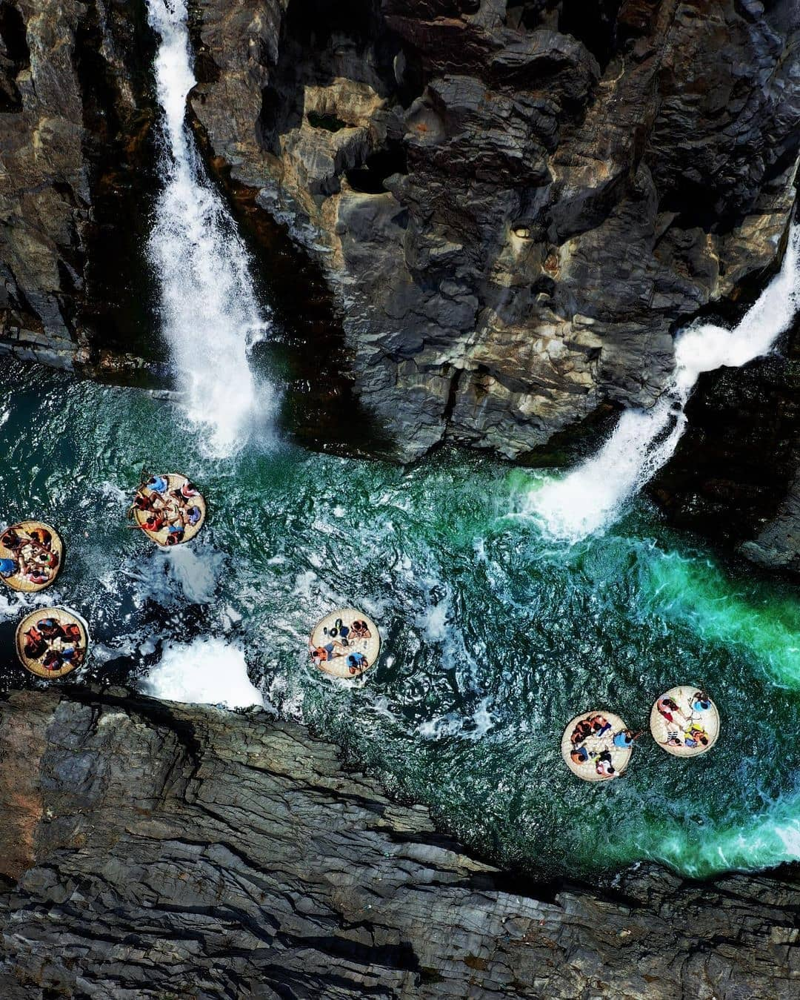
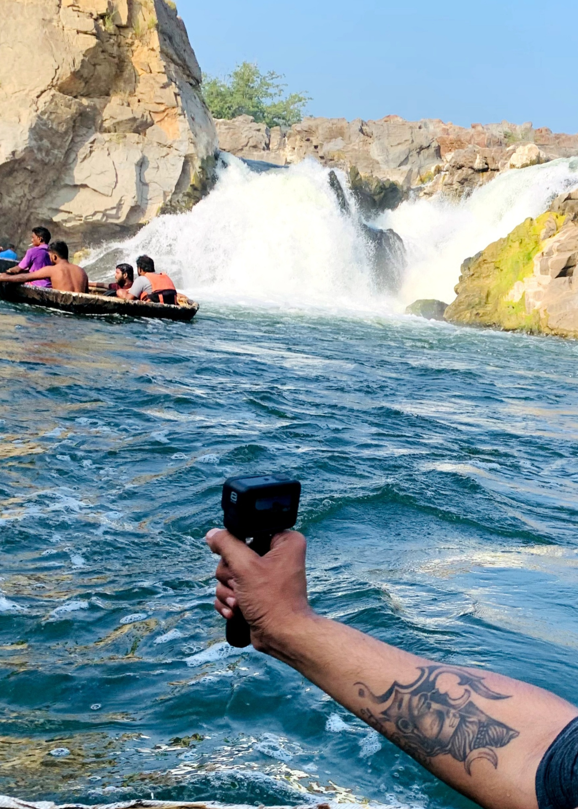

Hogenakkal Falls is a waterfall in South India on the Kaveri river on the border between Dharmapuri district of Tamil Nadu and Chamrajnagar district of Karnataka. 
 
A one day bike trip to Hogenakkal waterfalls started early morning on 26th December 2020. Its almost 130 km from Bangalore and took 3 hours to reach the destination. You can enter the river from both Karnataka and Tamilnadu end(INR 750/-).

It’s as if you have stepped into Paradise itself with swaying trees, clear skies, chirps of unknown birds floating into your ears, and the awe-inspiring natural beauty! The carbonatite rocks at Hogenakkal falls are the oldest igneous type of rocks found on Earth even before civilization! It’s not your fault if you confuse them with black marble especially when the waters glide down them shining orbs of black in the sunlight, looking no less than glistening onyx stones! The Kaveri at Hogenakkal cuts through numerous of these carbonatite rocks forming them into steps at various heights from where the falls come rushing down, creating a wide pool below.

And if you want to visit the other side of the river (for example you entered from Karnataka side and want to go to Tamilnadu side of the river then it will cost INR 1000/- more). I would recommend my viewers to enter from Karnataka side. You will get to see more views and afterwards no need to go to Tamilnadu side. This is an awesome place to explore/sightseeing and a weekend gateway.

 8 people can be accommodated on the coracle while it gently floats on the Kaveri River, which will have you swaying as gently as possible on both the sides as the coracle moves forward. You can witness the glorious scenic beauty of lush green vegetation around you, the shy fishes in the water hiding as swiftly as they appear, while dipping your hand in the cold water, feeling the chill run through your body, hearing the mighty roar of the Hogenakkal falls along with the rumbling of waters of the Kaveri accompanied by the chirp of crickets. Once you close your eyes you can very well imagine yourself enjoying a serene boat ride in the rivers of some dense forest!

Hogenakkal is a quaint little village in the district of Dharmapuri and is popular amongst visitors for the Hogenakkal Falls which gives a striking resemblance to the Niagara Falls! If you want to spend some peaceful time against the lap of nature, away from the mundanity of the city life, surrounded by vast vegetations of greenery wherever your eyes wander, along with the mighty sound of the Hogenakkal Falls then you are welcome to step into the land of this beautiful haven!