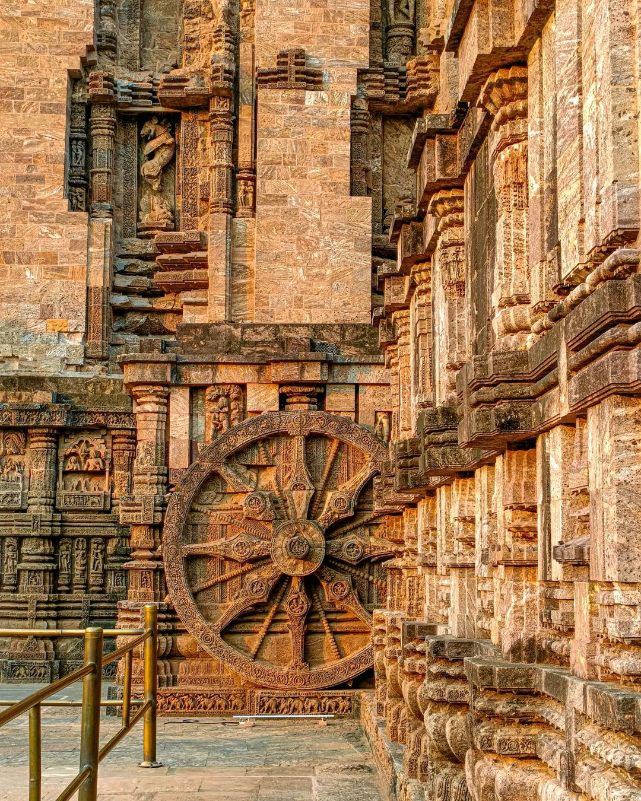
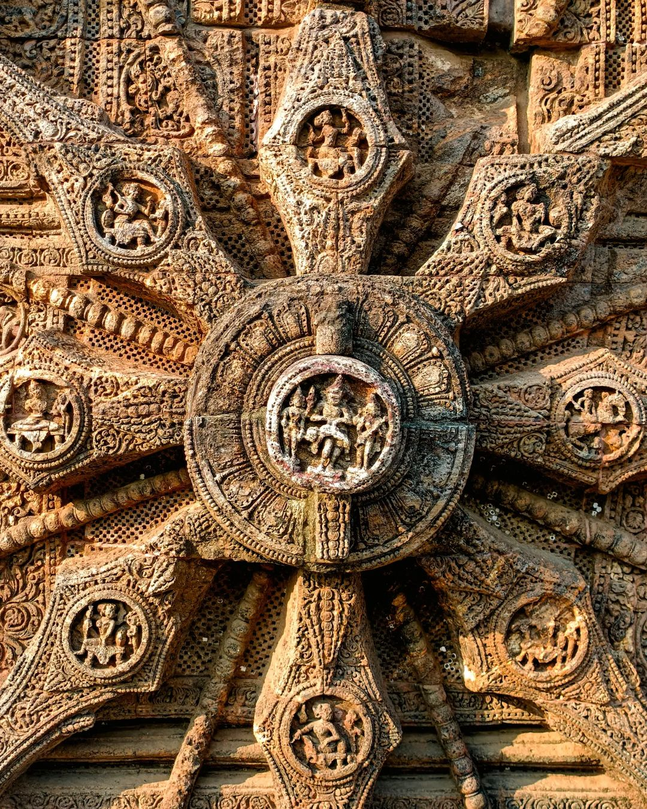
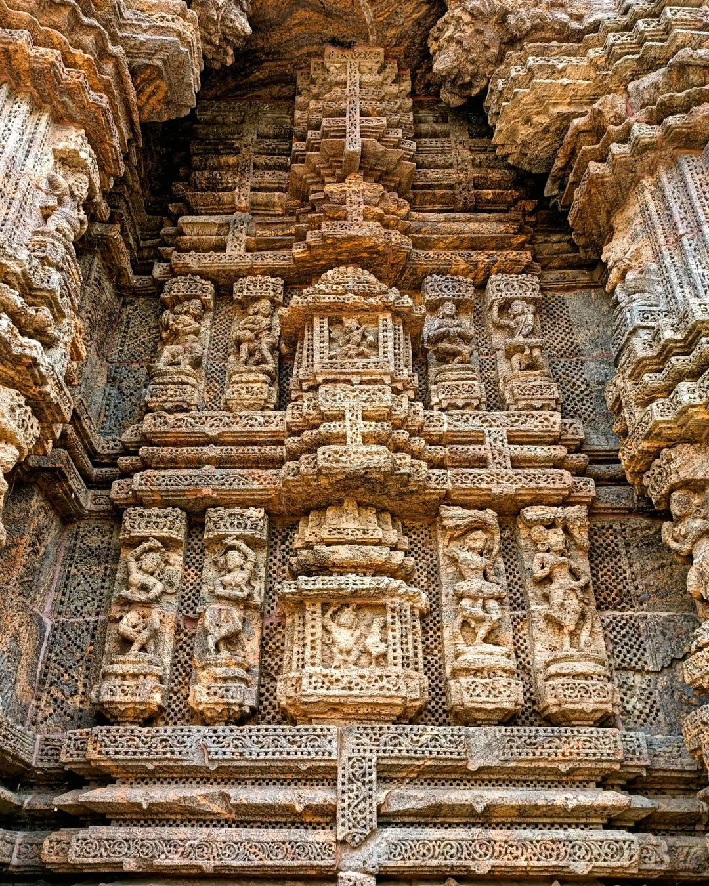

Konark Sun Temple is a 13th-century CE Sun temple at Konark about 35 kilometres northeast from Puri on the coastline of Odisha, India. 

The Konark or Konarak Sun temple is dedicated to the Hindu sun god Surya, and, conceived as a giant stone chariot with 12 wheels, it is the most famous of the few sun temples built in India.

The word 'Konark' is a combination of two Sanskrit words kona (corner or angle) and arka (the sun). It thus implies that the main deity was the sun god, and the temple was built in an angular format. 
