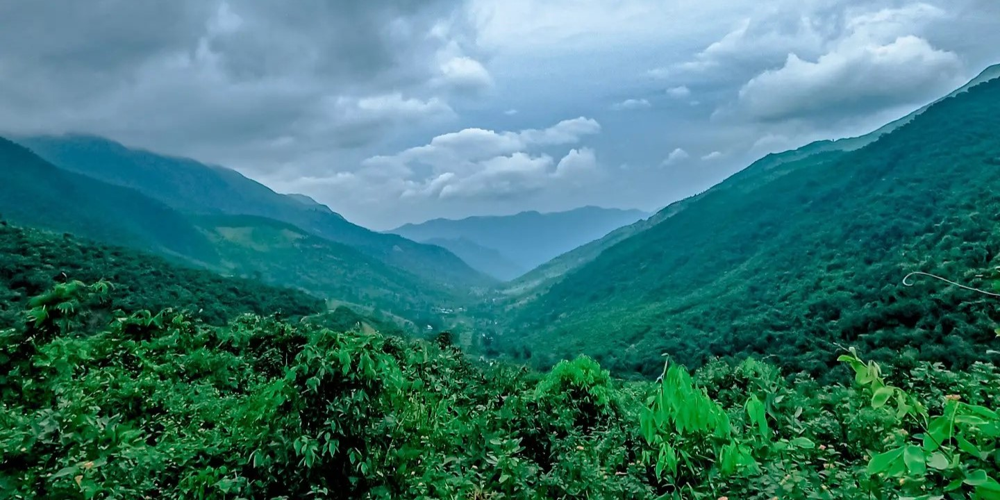
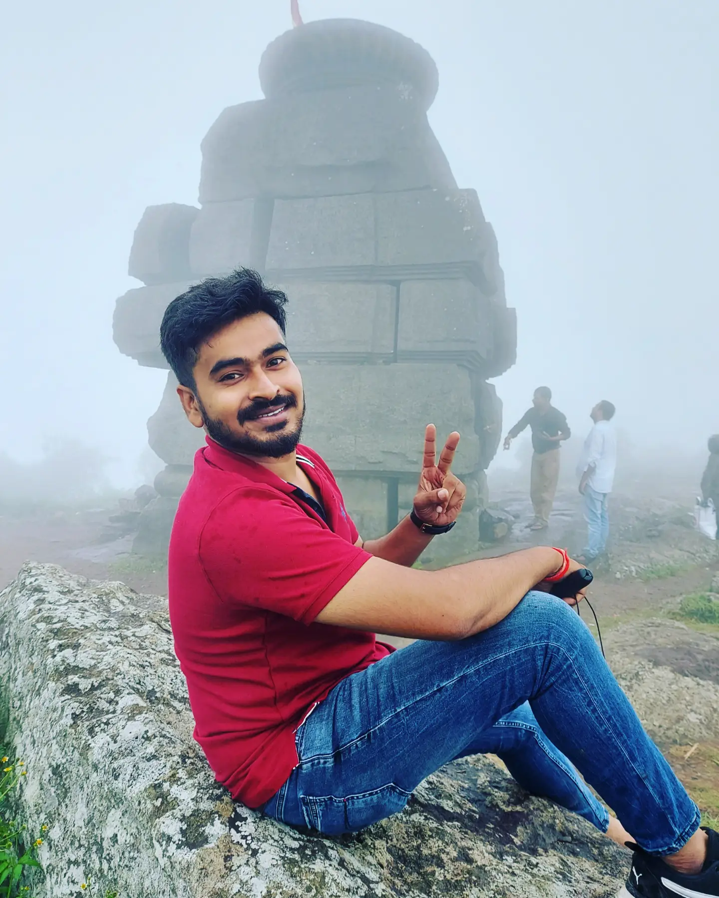
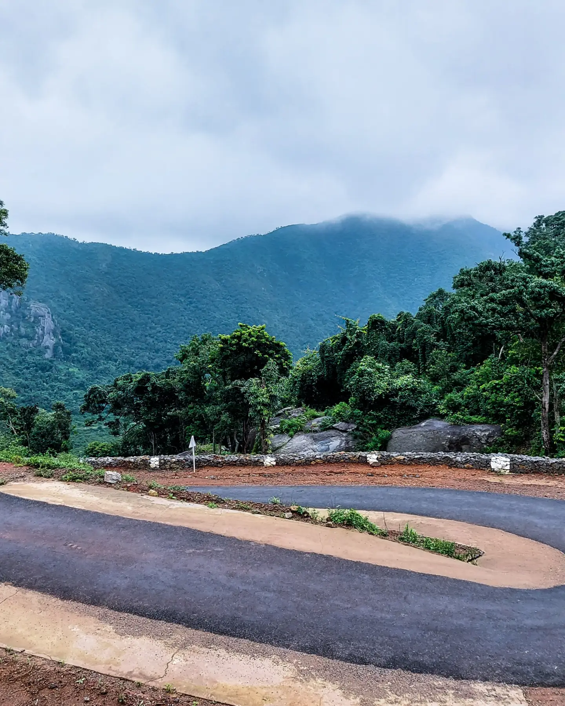
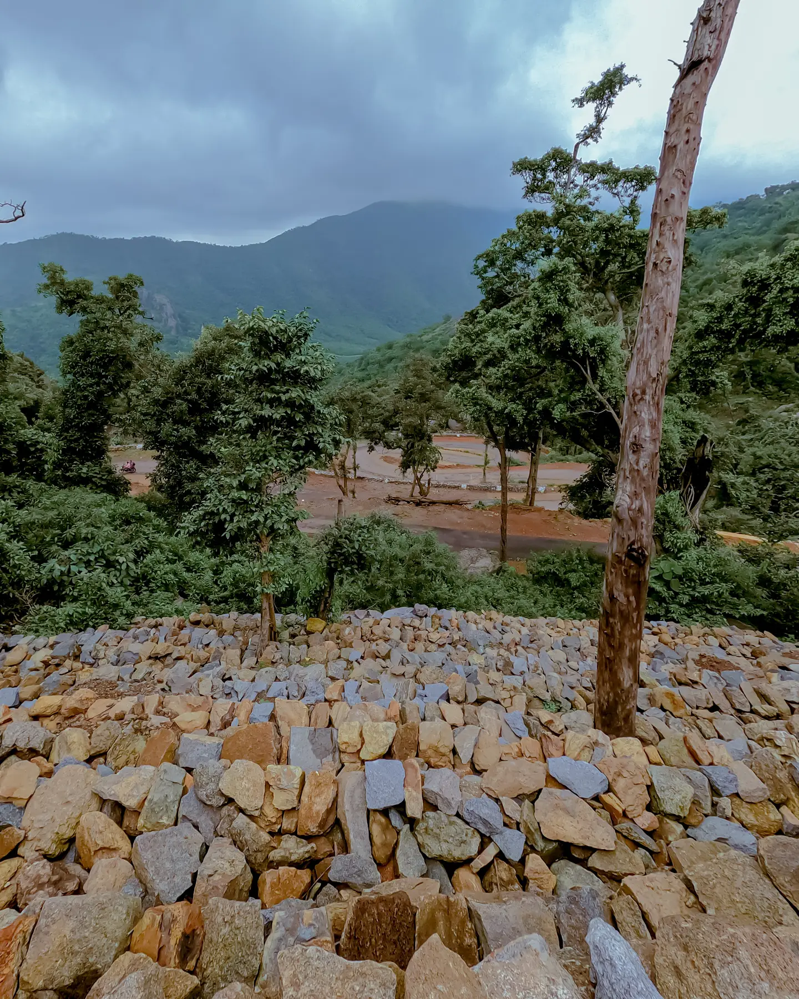

Mahendragiri is the 4th highest peak of Odisha which is situated amongst the Eastern Ghats at an elevation of 1,501 metres in the district of Gajapati in Odisha. Besides, the hills and their rugged beauty have always fascinated me so much so that whenever I meet with my close friends, we either reminisce our experiences of being on the hills or plan a visit to the place again. As such, when we got together this time, we planned a visit to the majestic mountain. 

The legend is that Pandavas visited Mahendragiri during their one-year period of living underground (ajnatavasam) and constructed the Shiva temples for worship at different places on the mountain. These temple structures come under the status of protected monuments under Antiquate Monument Archaeological Remains and Sites Act 1958. 

Mahendragiri is a beautiful place in the midst of cloud covered hills. I remember I couldn’t sleep the whole night before the day we visited this place. I was afraid of heights ; still I’m and we were ready to go to the 2nd highest peak of Eastern Ghats the next day. It was surely a mesmerizing experience for us and it will be for all of you too.

**Here is the part 2 of the journey**


**Feast your eyes with these beautiful views**

**Bhim Temple**

**The curve roads**

