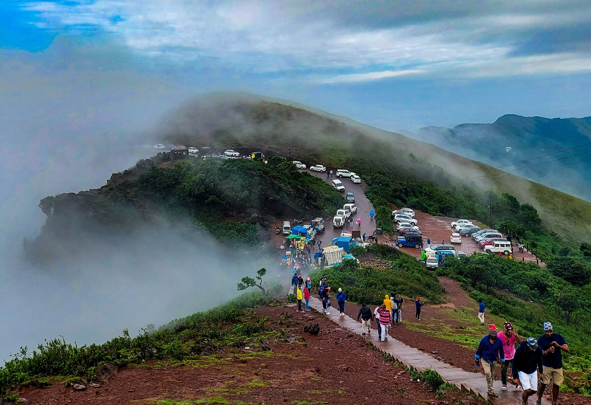
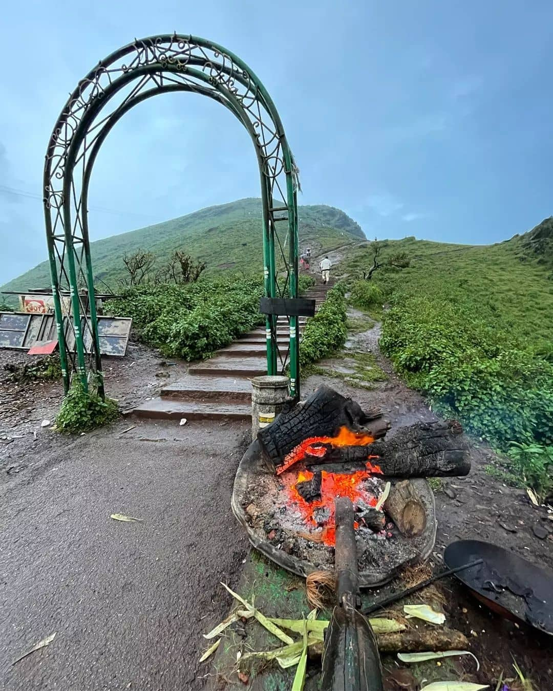
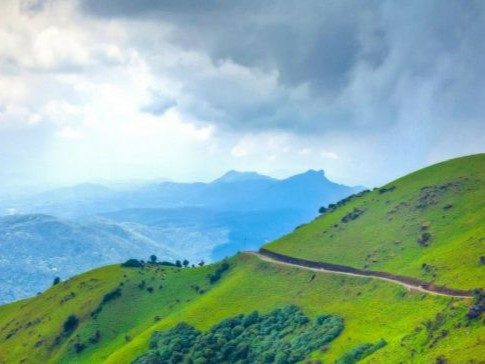

Mullayanagiri is the highest peak in Karnataka, India. It is located in the Chandra Dhrona Hill Ranges of the Western Ghats of Chikkamagaluru Taluk. With a height of 1,925 metres, it is the highest peak in Karnataka and also the highest peak in the Krishna River basin.



The peak gets its name from a small temple (gadduge/tomb) at the summit, which is dedicated to a sage "Mulappa swamy" who is believed to have meditated at the caves only a couple of feet below the summit. The caves are accessible and not very deep, they have a direct entrance to the garbagudi of the temple, which is now blocked by the temple priests. Apart from multiple versions of folklore and strong Siddha culture around the belt, the origins or any information about the deity remains ambiguous.

Situated at a distance of 20 km and 23 km respectively from Chikmagalur and Baba Budangiri. Adventure buffs have a lot of things to do here as the destination serves as a hub for trekking, mountain biking, and road biking. 

**Best time to visit:**
It is always good to plan your Mullayanagiri visit during the spring season. The heat in summers could turn out to be slightly exasperating while winters witnesses inundated trails. Mullayanagiri receives heavy downpours, and hence, the rainy season is also not a good season to plan your visit. The thick sheets of rain received here might blind you for the rest of your ascending journey. 

**History:**
Once there was a saint named Tapasvi Mullapa Swamy. Locals of the regions in and around the Mullayanagiri believe that he used to meditate at the top summit of this Mullayanagiri hill. In this manner, the mountain got its current identity. 

In the early days, when the asphalt rock and concrete steps were totally absent, people used to climb the summit by a trail known as Sarpanadi or Sarpadari. This is not so famous trails in modern days.

