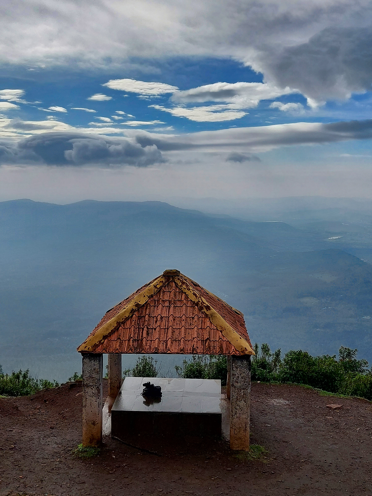

Mullayanagiri is the highest peak in Karnataka, India. Mullayanagiri is located in the Chandra Dhrona Hill Ranges of the Western Ghats of Chikkamagaluru Taluk. With a height of 1,925 metres, it is the highest peak in Karnataka and also the highest peak in the Krishna River basin.

The peak gets its name from a small temple (gadduge/tomb) at the summit, which is dedicated to a sage "Mulappa swamy" who is believed to have meditated at the caves only a couple of feet below the summit. The caves are accessible and not very deep, they have a direct entrance to the garbagudi of the temple, which is now blocked by the temple priests. Apart from multiple versions of folklore and strong Siddha culture around the belt, the origins or any information about the deity remains ambiguous.



