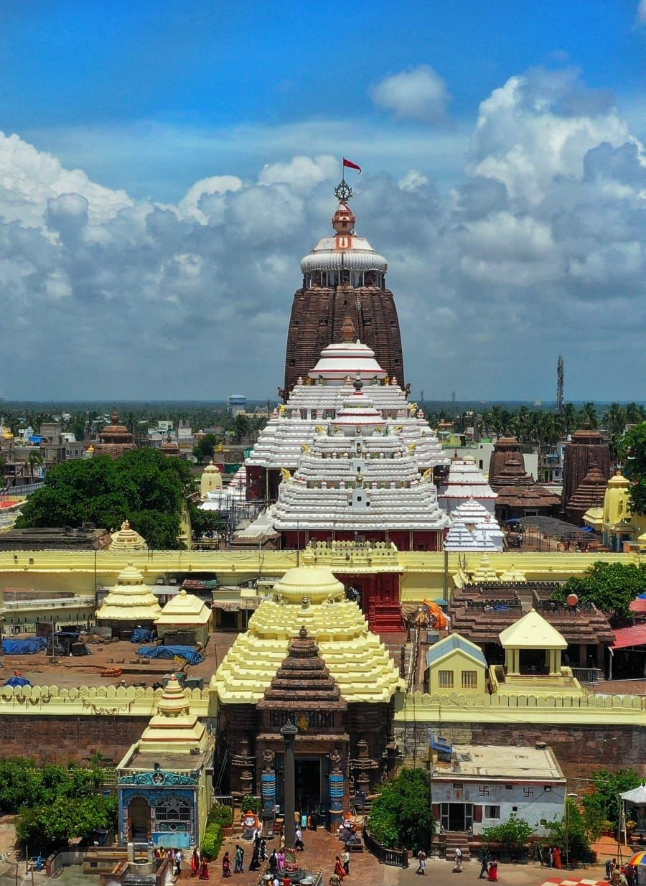
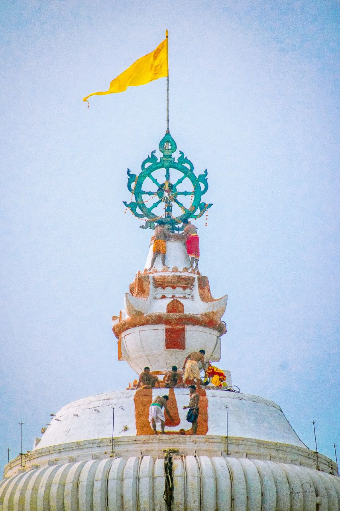
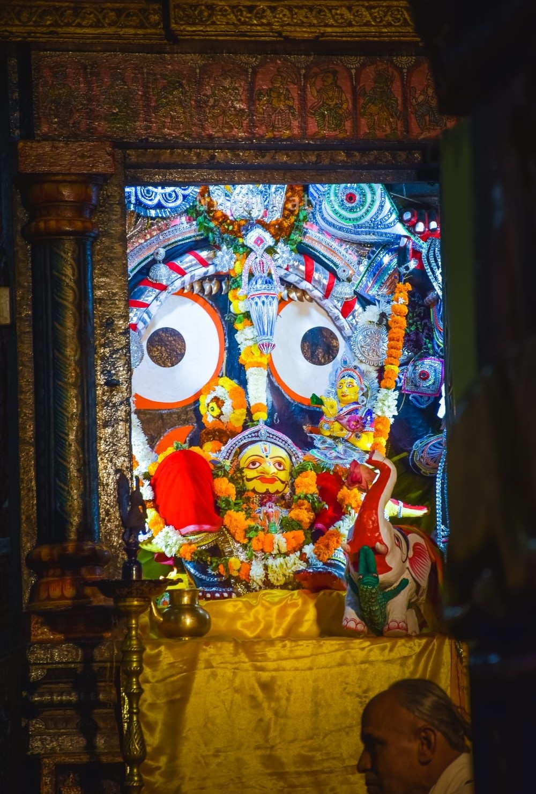
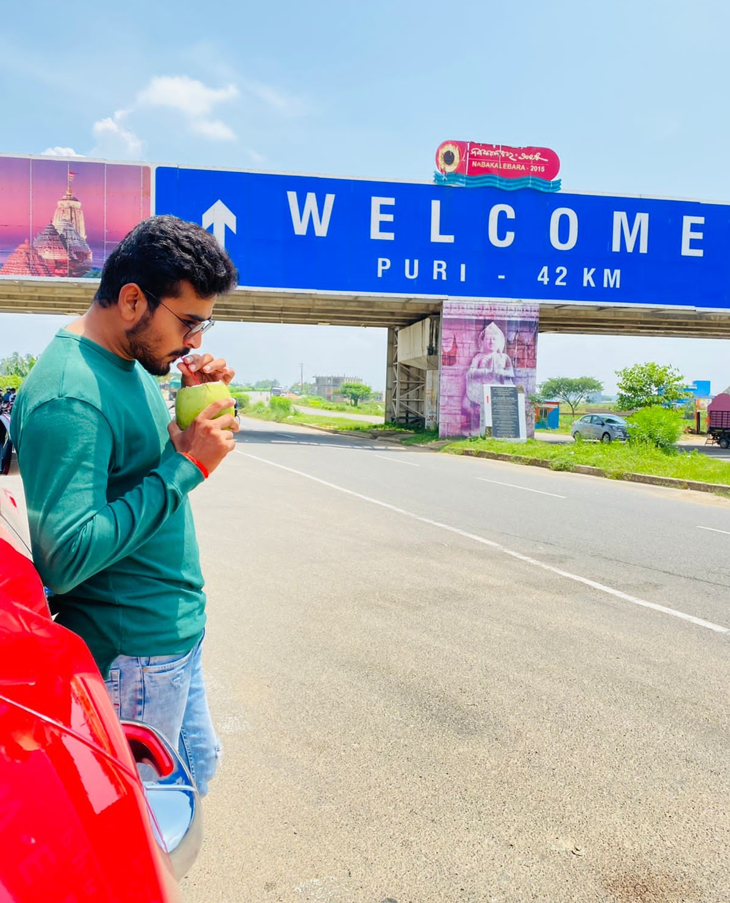

Puri is famous for the world famous Jagannath Temple & Longest Golden Beach. It is one of the Dhamas (Holiest of the holy place) out of four Dhamas i.e. Puri, Dwarika, Badrinath & Rameswar, in India. Lord Jagannath, Devi Subhadra and elder brother Balabhadra are being worshipped in Puri (The Purusottama Kshetra). The deities are seated on the Bejeweled Pedestal (Ratna Simhassana). 

Shree Jagannath Puri Temple is one of the most impressing monuments of the Indian State Odisha, was constructed by a famous king of Ganga Dynasty Ananta Varman Chodaganga Deva dating back to 12th century at the seashore Puri. The main temple of Jagannath is an impressing and amazing structure constructed in Kalinga architecture, with a height of 65 meters placed on an elevated platform. 

The metal wheel at the top of Lord Jagannath temple is known as Neela Chakra (Blue Wheel). The wheel is made of eight metals comprising of iron, copper, zinc, mercury, lead, brass, silver and gold. It's circumferance is about 36 feet and it is so designed that there is a wheel within the wheel. The circumferance of the inner wheel is about 26 feet. Eight hubs join together the inner and the outer wheels. There are decorative designs on the outer wheel. The thickness of the Neela Chakra is 2 inches.

The flag pole attached to the Neela Chakra is 38 feet long. After covering the breadth of the Neela Chakra, this pole extends 25 feet high above it. The figures carved on the outer circumference of the outer wheel are figures of eight Navagunjaras. In Hindu mythology the Navagunjara or Nabagunjara is a creature formed out of the parts of nine different animals and birds. All the eight Navagunjaras are facing towards the Neelachakra Flag.

Patitapabana is a combination of two words, 'Patita' and 'Pabana'. In local Odia language 'Patita' means 'Sinner' and 'Pabana' means 'purifier', so 'Patitapabana' combinely means 'One who can even purify the sinner'.

There is an interesting story behind the installation of 'Patitapabana' at the main entrance of the Jagannath Temple. As per history, to save the Jagannath Temple from destructions by the Muslim rulers, the Khurda and Puri King of that time Gajapati Ramachandra Dev-II (1732 to 1743 AD) married a Muslim girl under pressure of inadvertent conditions. By marrying a Muslim girl, the king had broken his religion and became a sinner. As per the temple rule, the King had inherent institutional right to worship Lord Jagannath as the Gajapati King. At that time the main concern of the temple priests was how to maintain this age old tradition. But understanding the king's devoted faithfulness to Lord Jagannath, the Priests made an alternative arrangement to solve the problem and installed the image of Lord Jagannath on the right side wall of the main entrance of the temple for Darshan from Grand road by the King and also for all other Patitas who are not allowed to enter into the temple. Since that day Lord Jagannath is worshipped as 'Patitapabana' at this place.

While entering to Puri Dham, you will see this beautiful gate.
