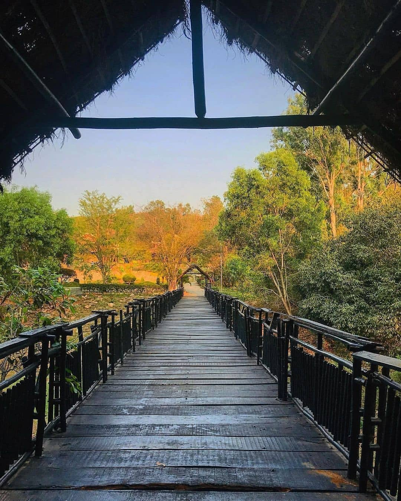

Pyramid Valley International, a serene valley surrounded by greenery and small hills, is the perfect place for going deep within oneself. The 28-acre campus hosts the world’s largest pyramid structure built solely for meditation. 
 
Towering to the height of 100 feet/ 30 meters — the height of a 10-storey building — the Mega-Pyramid is a silent abode of sacred energies that allows meditators to experience calmness pretty rapidly. 
