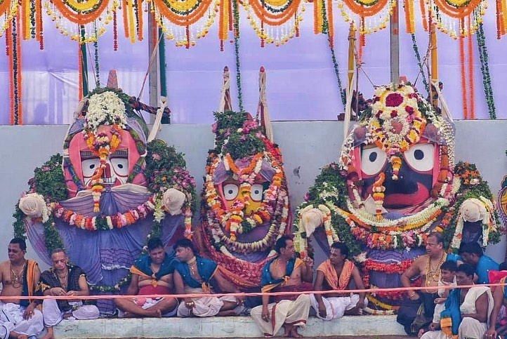
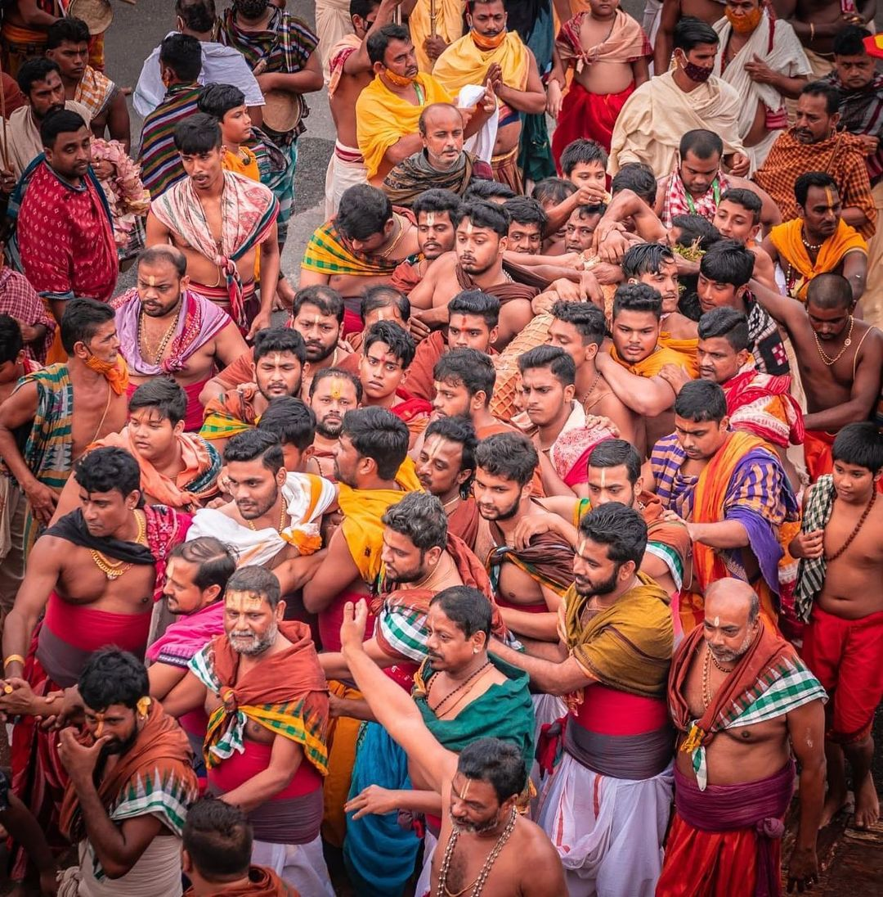
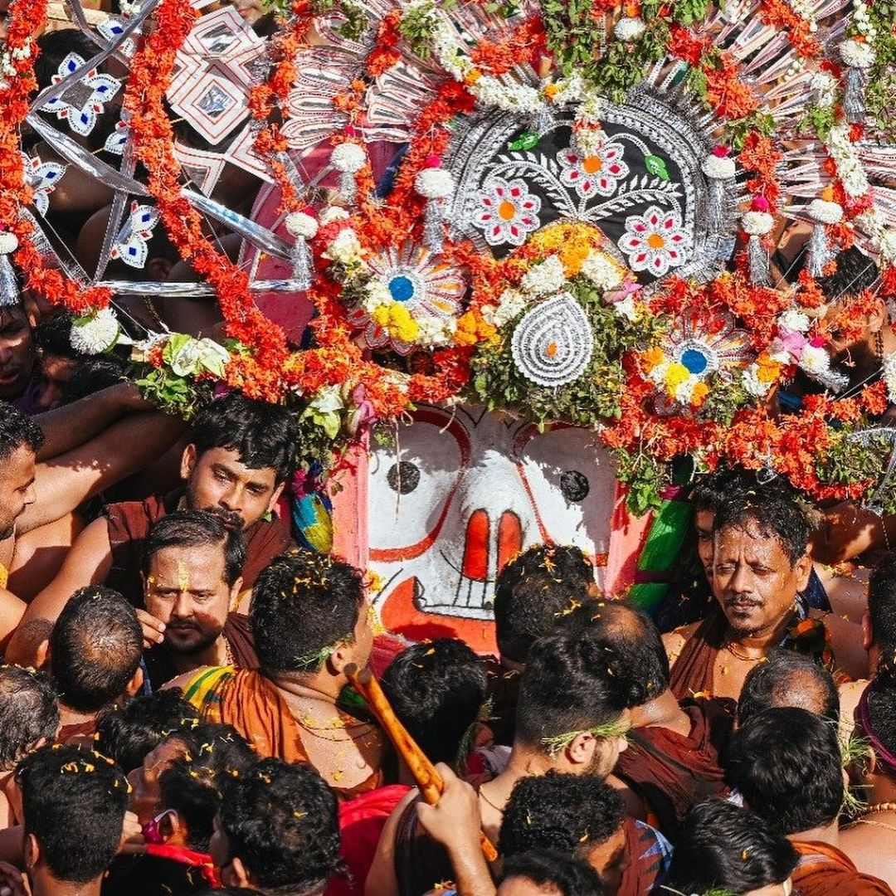
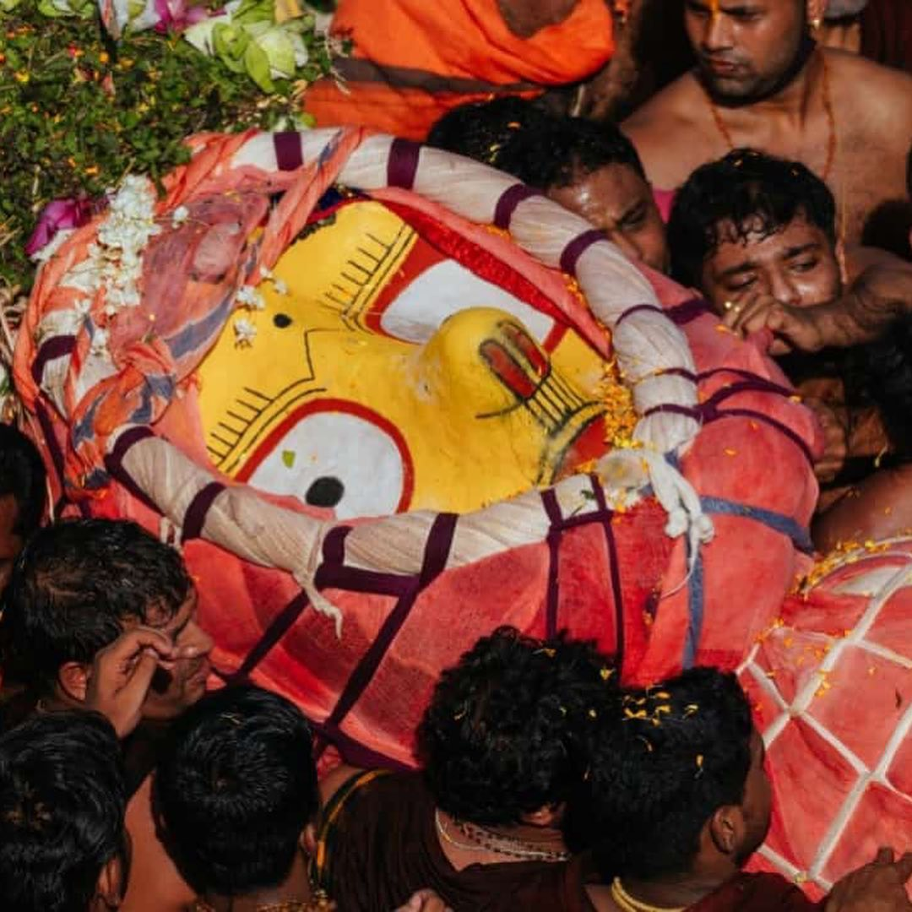
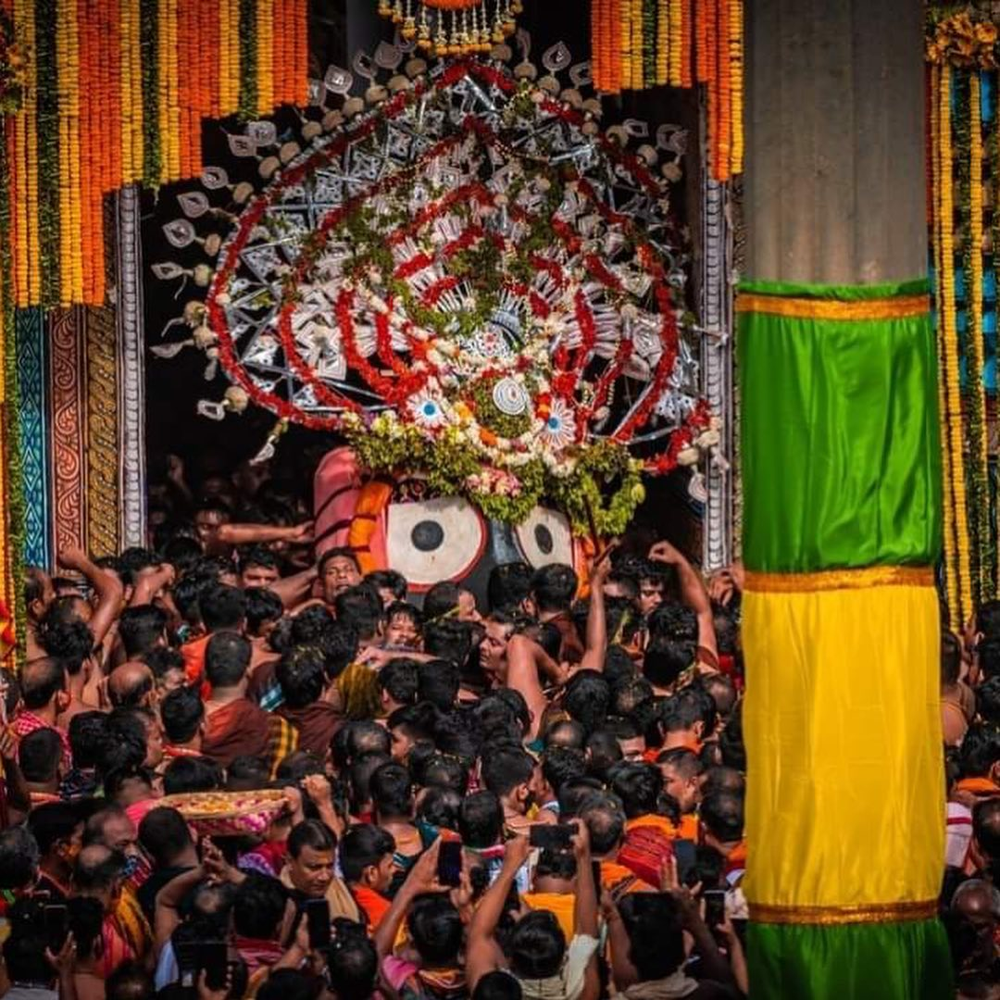
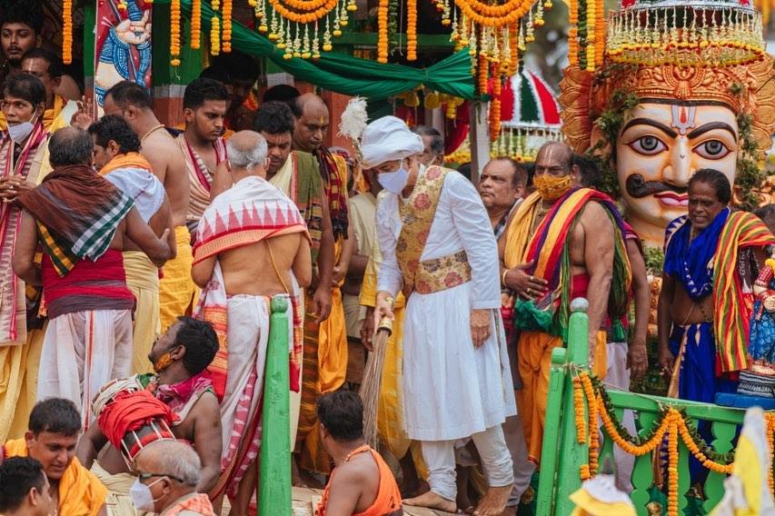
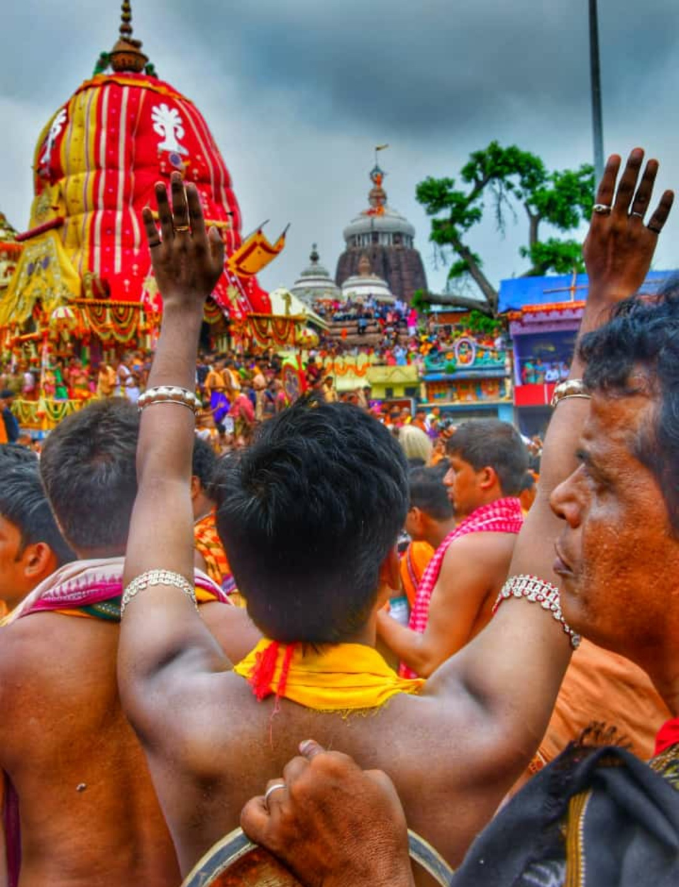

Ratha Jatra is a Hindu festival associated with Lord Jagannath held at Shri Kshetra Puri Dham in the state of Odisha, India. It is the oldest Ratha Yatra, whose descriptions can be found in Brahma Purana, Padma Purana, and Skanda Purana and Kapila Samhita.
 
RathaYatra is a colorful festival which draws millions of devotees from various parts of the country as well as from abroad to Puri, is held in June-July every year. Lord Jagannath, Lord of the Universe, comes out of His sanctum sanctorum to give Darshan to all Devotees belonging to all sects and communities.

After the completion of morning rituals mangal arati, khechedi bhog etc on the 2nd day of Asadha sukla tithi, the mangalarpana ritual is performed. The four deities come on pahandi(cerimonial procession). 

**Lord Sudarshana Pahandi**

**Lord Balabhadra Pahandi**

**Maa Subhadra Pahandi**

**Lord Jagannath Pahandi**

After boading the deities on their respective chariots, the chera pamhara(moping the chariots in a golden broom) ritual performed by Gajapati Maharaj. 

And there after the chariots (Nandighosha-chariot of Lord Jagannath) (Taladhwaja-chariot of Lord Balabhadra) (Debadalana-chariot of Maa Subhadra) pull by lackh of devotees. 

