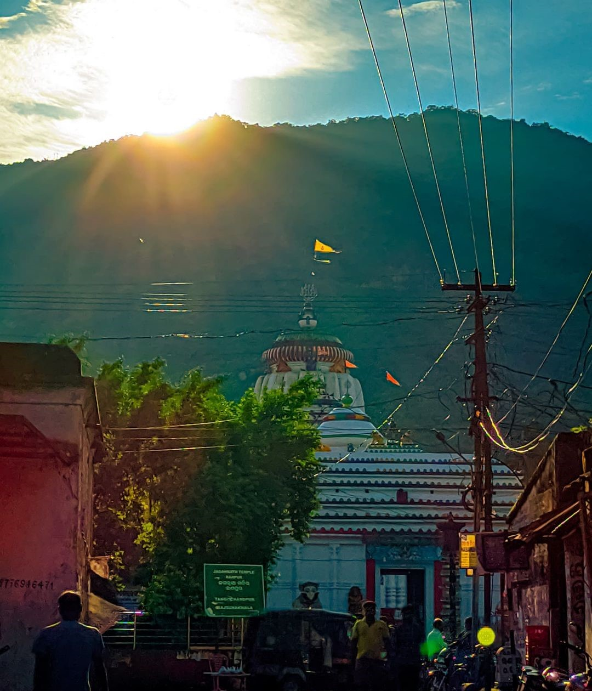
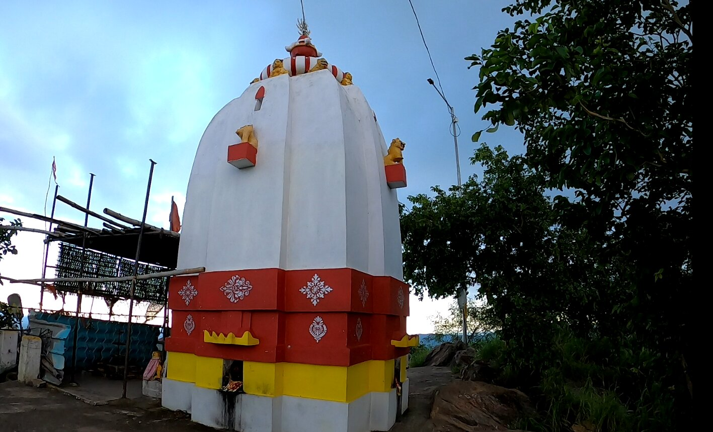

Raj-Ranpur is a small town in the district of Nayagarh in the eastern Indian state of Odisha. The village is also known as Ranpurgarh or simply Ranpur as per the modern usage. The village is historically significant especially during the British Raj when it was the capital of the princely state of Ranpur.


The view of Raj-Ranpur township and surrounding region from the hilltop is simply extra ordinary and it's tough for me to describe it by words. So better to view few pictures those i clicked at the spot.

**Sunset at hill top**

The famous Drutiya Srhiketra  Jagannath temple of Raj Ranpur and Maninag Durga temple at top of adjacent maninag hill were built by ranpur's celebrated king udbhava singh narendra in the mid 14th century. Though the Goddess was getting worshiped in the region since Mahabharata era as per folklore.

**Jagannath temple at hill base**

The family history of this state describes, biswabasu and biswabasab two brothers of benu raj family lived in the forest of Nilagiri hill but were driven out. The younger brother biswabasab fled with a few attendants and took refuge in the valley  of maninag hill, amidst vast forest tracts, sparsely inhabited. Biswabasab here established himself reclaiming the forest and gradually subdued bhuiyas of the neighboring villages. It is related that one day when biswabasab was walking in the forest he found an image of Goddess which he brought to maninag hill and worshiped her as Goddess Maninaga.

The Goddess being pleased with worship appeared before and directed him to live there and establish a village on the eastern side of the hill. Biswabasaba as per the wish of Goddess Maninaga established the village and named it as "Ranpur". He named it as ranpur in praise of the Goddess Maninag who earlier killed a demon named "Ranasura" ruling at this region.

