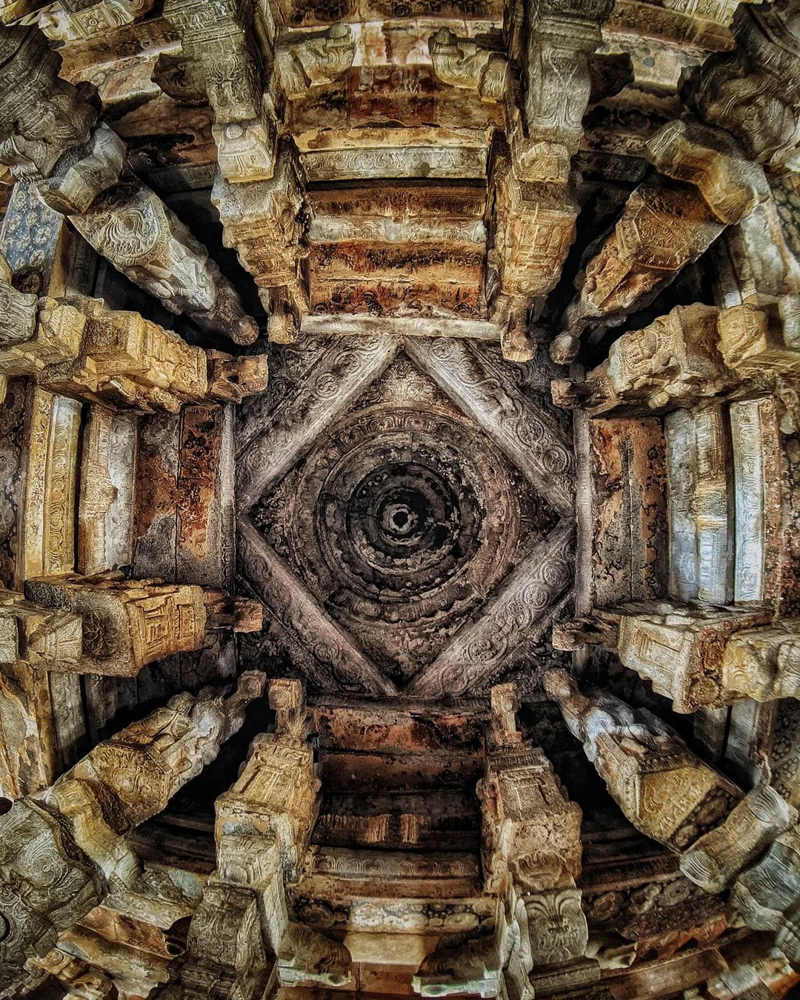
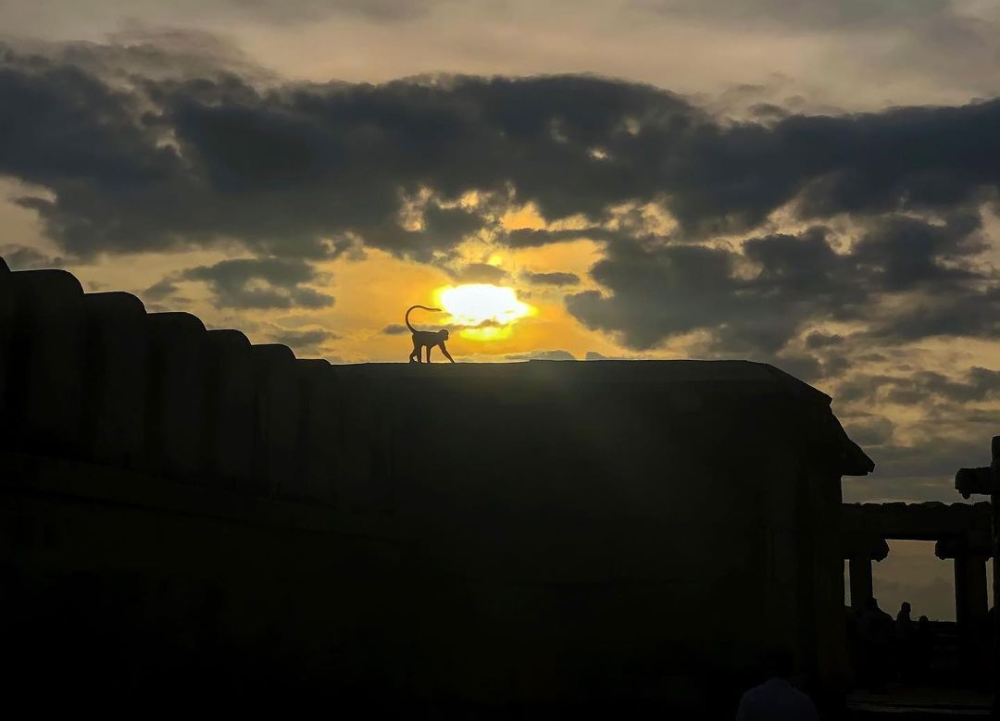
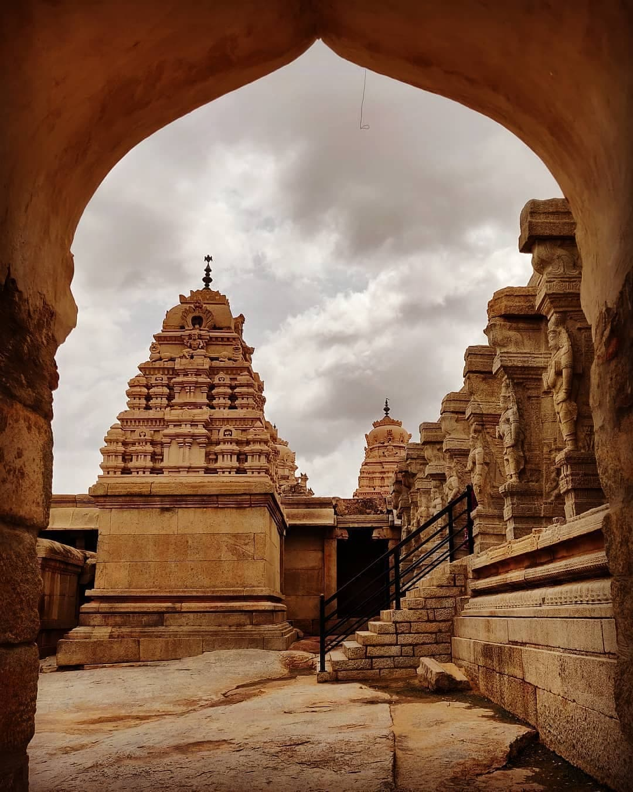
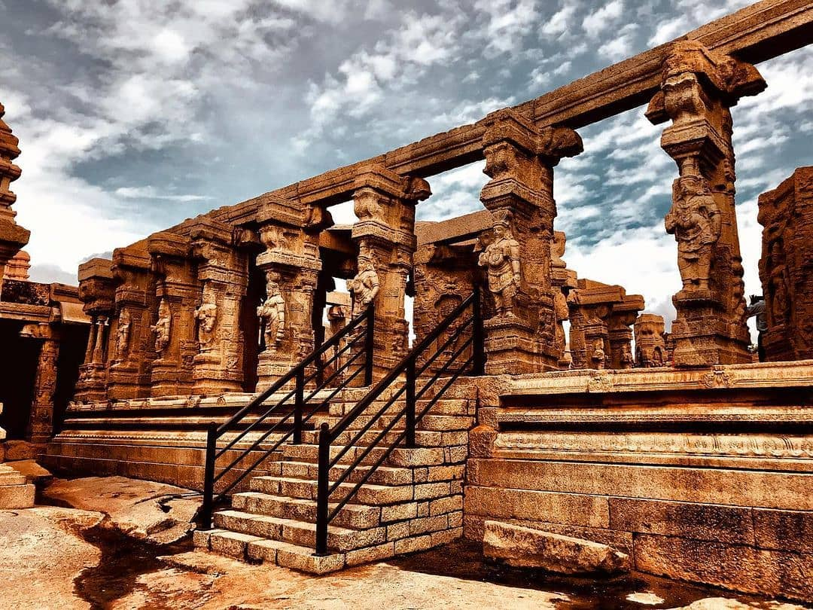

The village of Lepakshi is located in the District of Anantapur, about 13 km from Hindupur. The village is famous for its three shrines, which are dedicated to Lord Vishnu, Lord Shiva and Lord Veerabhadra. The Veerabhadra Temple was constructed by two brothers, Viranna and Virupanna. The temple is built in the Vijayanagar architectural style and has beautiful sculptures adorning the walls. There is a huge Nandi bull made from a single granite stone. Lepakshi has many murals from the Vijayanagar Era and the famous sculpture of the snake on the Nagalinga. Local legend claims that the 'naga' was carved from a single block of stone while the sculptors were waiting for their mother to cook lunch for them!



