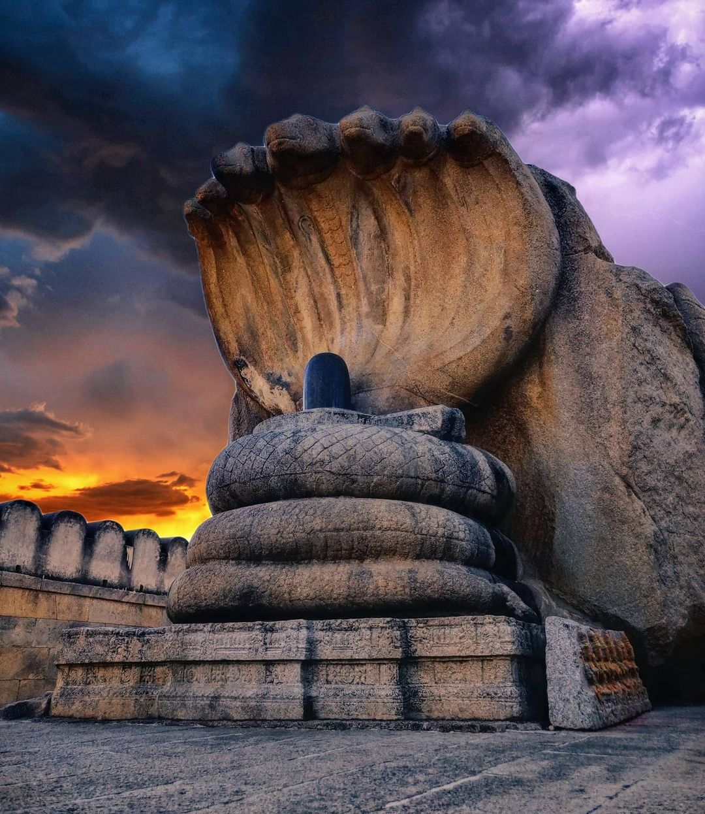
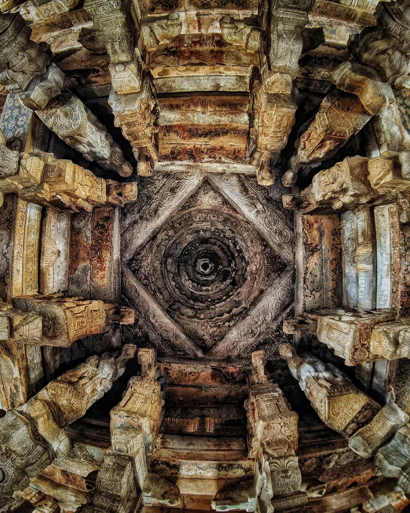
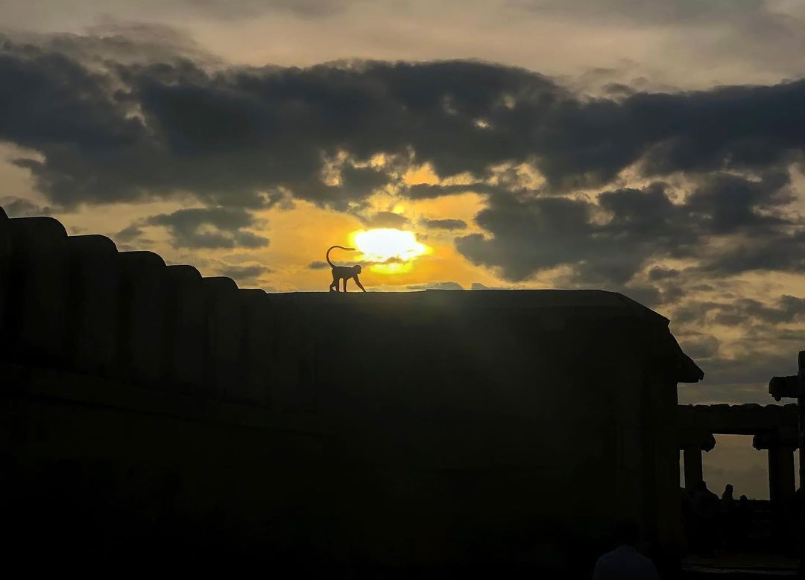
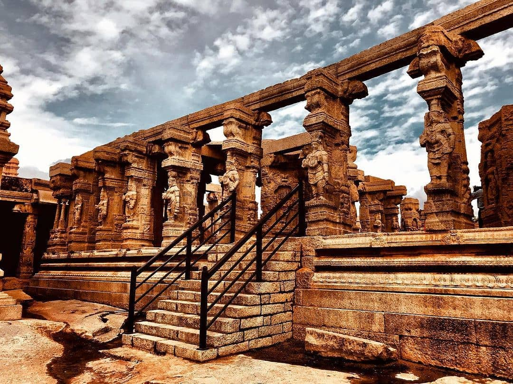

The village of Lepakshi is located in the District of Anantapur, about 13 km from Hindupur. The village is famous for its three shrines, which are dedicated to Lord Vishnu, Lord Shiva and Lord Veerabhadra. The Veerabhadra Temple was constructed by two brothers, Viranna and Virupanna. The temple is built in the Vijayanagar architectural style and has beautiful sculptures adorning the walls. There is a huge Nandi bull made from a single granite stone. 



Lepakshi has many murals from the Vijayanagar Era and the famous sculpture of the snake on the Nagalinga. Local legend claims that the 'naga' was carved from a single block of stone while the sculptors were waiting for their mother to cook lunch for them!

Lepakshi temple holds significant importance in Indian history. In Ramayana, when Ravana abducting Sita, Jatayau came to rescue. But he fell after being slain by Ravana. On coming across seeing wounded Jatayau, Sri Ram said “Le Pakshi” ( Rise Bird ) in Telegu before healing him. So, the village got its name “LEPAKSHI”.

You will see an incomplete structure once you cross the shivalinga known as Kalyan Mandapa. The treasurers of King started the construction with the kingdom’s money without King’s order. Once the king came to know, he immediately stopped the construction and punished the treasurers. Since then, the structure is stil incomplete.

It’s an ideal place for weekend traveller from Bangalore. I hope you liked this virtual tour of Lepakshi with me. If you did please feel free to share with your friends and follow my vlog for more interesting destinations.

